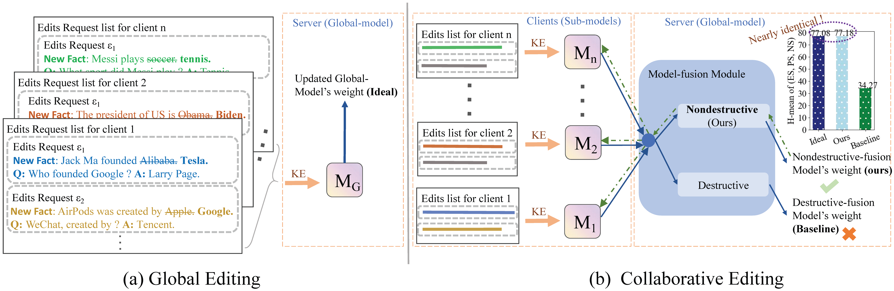

# CollabEdit: Towards Non-destructive Collaborative Knowledge Editing

<h5 align="center"> If our project helps you, please give us a star ⭐ and cite our <a href="https://arxiv.org/abs/2410.09508">paper</a>!</h2>
<h5 align="center">

## Overview

Collaborative learning of LLMs has emerged as a new paradigm for utilizing private data from different parties. Meanwhile, Knowledge Editing (KE) for LLMs has also garnered increased attention due to its ability to manipulate the behaviors of LLMs explicitly, yet leaves the collaborative KE case unexamined (in which knowledge edits of multiple parties are aggregated in a privacy-preserving and continual manner):

* Destructive collaborative KE ( a naive combination of single-model KE methods and model fusion techniques) suffer from significant performance degradation.
* Currently, there is no existing method to address the three important challenges (knowledge overlap, knowledge conflict, and knowledge forgetting) that we have identified in collaborative scenarios.

Therefore, we designed CollabEdit to nondestructively integrate edits from multiple LLMs simultaneously and, based on this framework, propose a solution to address the three challenges.

<div align="center">
     
    <br/>
    <figcaption>Overview of CollabEdit.</figcaption>
</div>

## Installation

We recommend `conda` for managing Python, CUDA, and PyTorch; `pip` is for everything else. To get started, simply install `conda` and run:

```bash
CONDA_HOME=$CONDA_HOME ./scripts/setup_conda.sh
#example 1
CONDA_HOME=~/miniconda3 ./scripts/setup_conda.sh
#example 2
CONDA_HOME=/opt/anaconda3 ./scripts/setup_conda.sh
```

`$CONDA_HOME` should be the path to your `conda` installation, e.g., `~/miniconda3`.

## How to use our codebase for collaborative KE?

### 1. Collaborative KE in a single round (i.e., each client submits edit requests once):

1) Comparing standard KE (Global-Editing), destructive collaborative KE (SA, TA, Ties) and our nondestructive collaborative KE (CollabEdit) in a single round:

```BASH
# GPT-J
python3 -m experiments.merging_singleRound --alg_name=MEMIT --model_name=EleutherAI/gpt-j-6B --hparams_fname=EleutherAI_gpt-j-6B.json --num_edits_per_client_per_round=500 --num_clients=10 --use_cache --merging_method=CollabEdit 

# GPT2-XL
python3 -m experiments.merging_singleRound --alg_name=MEMIT --model_name=gpt2-xl --hparams_fname=gpt2-xl.json --num_edits_per_client_per_round=500 --num_clients=10 --use_cache --merging_method=CollabEdit 
```

* `merging_method` includes `["GLOBAL", "SA", "TA", "TIES", "CollabEdit"]`.
  * `"GLOBAL"` means **Global-Editing** *(Upper bound)*
  * `"SA"` means **Simple-Average**. 
  * `"TA"` means **Task-Arithmetic**.
  * `"TIES"` means **Ties-Merging**.
  * `"CollabEdit"` means our **CollabEdit**.
* By default, we assume there are `10` clients and each client has `500` edit requests. You can easily modify our code to handle different numbers of edit requests from different clients.

* Results of each run are stored at `results/<method_name>/run_<run_id>`:

```bash
results/
|__ MEMIT/
    |__ run_<run_id>/
        |__ params.json
        |__ case_0.json
        |__ case_1.json
        |__ ...
        |__ case_10000.json
```

2) To summarize the results, you can use [`experiments/CollabEdit_summarize.py`](experiments/CollabEdit_summarize.py). 

```bash 
python3 -m experiments.CollabEdit_summarize --dir_name=MEMIT --edit_category global_edit --runs=run_<run_id>
```

* `edit_category: ["global_edit", "collabrative_edit"]` 
  * Set `edit_category` to `global_edit` when you use **GLOBAL**. 
  * Set `edit_category` to `collaborative_edit` when you use **SA**/**TA**/**TIES**/**CollabEdit**.


### 2. Collaborative KE in multiple rounds (i.e., each client submits edit requests multiple times):

1) Comparing Global-Editing, SA, TA, Ties and our CollabEdit in multiple rounds:
```BASH
# GPT-J
python3 -m experiments.merging_multiRound --alg_name=MEMIT --model_name=EleutherAI/gpt-j-6B --hparams_fname=EleutherAI_gpt-j-6B.json --num_edits_per_client_per_round=100 --num_clients=10 --num_rounds=5 --use_cache --merging_method=CollabEdit 

# GPT2-XL
python3 -m experiments.merging_multiRound --alg_name=MEMIT --model_name=gpt2-xl --hparams_fname=gpt2-xl.json --num_edits_per_client_per_round=100 --num_clients=10 --num_rounds=5 --use_cache --merging_method=CollabEdit
```

* You can modify the following variables to adjust the total number of edit requests (`num_edits = num_clients x num_edits_per_client_per_round x num_rounds`):
  * `num_clients`: The number of clients.
  * `num_edits_per_client_per_round`: The number of edit requests made by a client in a round.
  * `num_rounds`: The number of rounds. 
* We introduce *Dynamic Covariance* in our **CollabEdit** algorithm to enhance multi-round editing, which can significantly improve the editing performance and mitigate *Knowledge Forgetting*.

2) To summarize the results, you can use [`experiments/CollabEdit_summarize.py`](experiments/CollabEdit_summarize.py). 

## Additional experiments
#### (1) Evaluate knowledge forgetting and the performance of Dynamic Covariance $\mathbf{C}$:

```BASH
#Knowledge Forgetting on GPT-J
python3 -m experiments.multiround --alg_name=MEMIT --model_name=EleutherAI/gpt-j-6B --hparams_fname=EleutherAI_gpt-j-6B.json --num_edits=1000 --use_cache

#Knowledge Forgetting on GPT2-XL
python3 -m experiments.multiround --alg_name=MEMIT --model_name=gpt2-xl --hparams_fname=gpt2-xl.json --num_edits=1000 --use_cache
```

We test how Knowledge Forgetting affects the final editing outcome in the [multiround.py](experiments/multiround.py) script. (Immutable $\mathbf{C}$)

```BASH
#Mitigating Knowledge Forgetting on GPT2-XL with Dynamic Covariance
python3 -m experiments.C_1 --alg_name=MEMIT --model_name=gpt2-xl --hparams_fname=gpt2-xl.json --num_edits=1000 --use_cache

#Mitigating Knowledge Forgetting on GPT-J with Dynamic Covariance
python3 -m experiments.C_1 --alg_name=MEMIT --model_name=gpt2-xl --hparams_fname=gpt2-xl.json --num_edits=1000 --use_cache
```

We tested in the [C_1.py](experiments/C_1.py) whether our proposed Dynamic Covariance can mitigate the problem of Knowledge Forgetting. (Dynamic $\mathbf{C}$)

To summarize the results, you can use [`experiments/CollabEdit_summarize.py`](experiments/CollabEdit_summarize.py).

#### (2)  Test Knowledge overlap and the $\ell_2$-norm of  Residual $\mathbf{R}$:

The experiment is relatively straightforward, so we decide not write an additional script. If you want to experiment and observe Residual $\mathbf{R}$, you only need to make some minor modifications to [merging_singleRound.py](experiments/merging_singleRound.py). The steps are as follows:

* Firstly, change the `record_chunks` on line `133` of [merging_singleRound.py](experiments/merging_singleRound.py) to `1000` repeated first elements.

```python
...
for record_chunks in Rec_chunks:
        #generate repeat examples
        repeat_item = record_chunks[0]
        front_list = []
        for i in range(1000):
            front_list.append(repeat_item)
        front_list.extend(record_chunks)
        record_chunks = front_list
        ...
```

* Secondly, locate the intermediate variable `R_L2` on line `258` under [memit_main.py](memit/memit_main.py), and print it within every editing round to observe the change in the $\ell_2$-norm of the Residual $\mathbf{R}$ as the number of repeated editing rounds increases.

```python
        ...
    	adj_k = torch.linalg.solve(
                    hparams.mom2_update_weight * cov.double() + layer_ks @ layer_ks.T,
                    layer_ks,
                )
        resid = targets / (len(hparams.layers) - i)  # Distribute residual across layers
        R_L2 = torch.linalg.norm(resid)
        #print("R_L2: ",R_L2)
        upd_matrix = resid @ adj_k.T
        ...
```

To summarize the results, you can use [`experiments/CollabEdit_summarize.py`](experiments/CollabEdit_summarize.py).

#### (3)  Test Knowledge conflict and the effects of data augmentation.:

```BASH
#TEST Conflict（full）on GPT2-XL
python3 -m experiments.Conflict --alg_name=MEMIT --model_name=gpt2-xl --hparams_fname=gpt2-xl.json --use_cache --ds_name=mcf_conflict --conflict_exp_type=whetherConflict --num_edits=2500 --dataset_size_limit 2500
#TEST Conflict（full）on GPT-J
python3 -m experiments.Conflict --alg_name=MEMIT --model_name=EleutherAI/gpt-j-6B --hparams_fname=EleutherAI_gpt-j-6B.json --use_cache --ds_name=mcf_conflict --conflict_exp_type=whetherConflict --num_edits=2500 --dataset_size_limit 2500
```

* `conflict_exp_type` includes `["whetherConflict","Performance_A","Performance_B","Performance_[A+B]","single_B"]` . `A` denotes the original edits and `B` denotes the conflict edits.
  * `whetherConflict` : We edited `A` but evaluated model‘s performance based on `B`'s answers to verify whether `A`'s answer conflict with that of `B`.
  * `Performance_A`: We only tested the performance on `A`, which is equivalent to running `merging.py`. ( Edit $\mathcal{E}$ )
  * `Performance_B`: We edited both `A` and `B`, but we ultimately evaluated the model's performance based on `A`'s answers. （ Edit $\mathcal{E}^{\prime}$ ）
  * `Performance_[A+B]`: We edited both `A` and `B`, but we ultimately evaluated the model's performance based on `B`'s answers.

```BASH
#TEST data augmentation for knowledge conflict on GPT2-XL
python3 -m experiments.evaluate_augmentation --alg_name=MEMIT  --model_name=gpt2-xl --hparams_fname=gpt2-xl.json --dataset_size_limit 1000 --num_edits 1000  --mode=easy
#TEST data augmentation for knowledge conflict on GPT-J
python3 -m experiments.evaluate_augmentation --alg_name=MEMIT  --model_name=EleutherAI/gpt-j-6B --hparams_fname=EleutherAI_gpt-j-6B.json --dataset_size_limit 1000 --num_edits 1000  --mode=easy
```

To summarize the results, you can use [`experiments/CollabEdit_summarize.py`](experiments/CollabEdit_summarize.py). 

## Acknowledgement

We are grateful for the following awesome projects:

* [MEMIT](https://github.com/kmeng01/memit)
* [PitfallsKnowledgeEditing](https://github.com/zjunlp/PitfallsKnowledgeEditing)

## How to Cite

```bibtex
@article{zheng2024collabedit,
  title={CollabEdit: Towards Non-destructive Collaborative Knowledge Editing},
  author={Zheng, Jiamu and Zhang, Jinghuai and Du, Tianyu and Zhang, Xuhong and Yin, Jianwei and Lin, Tao},
  journal={arXiv preprint arXiv:2410.09508},
  year={2024}
}
```

